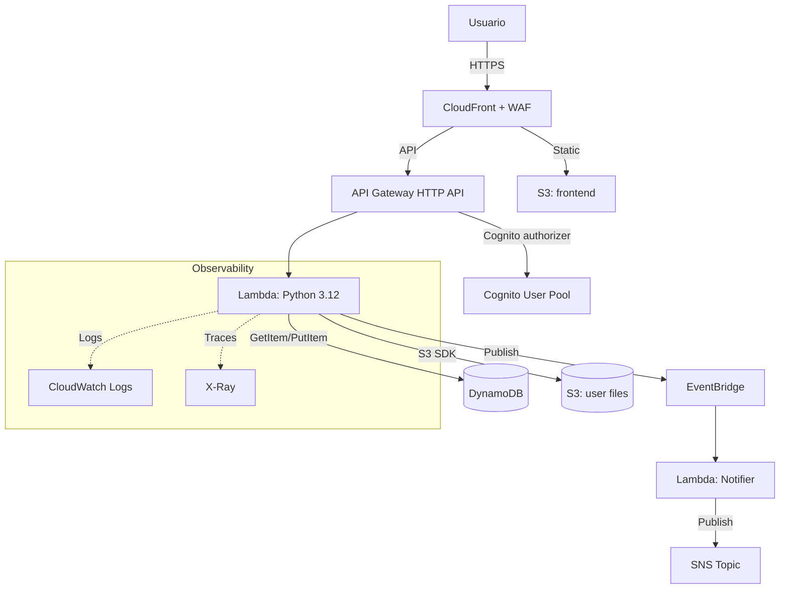
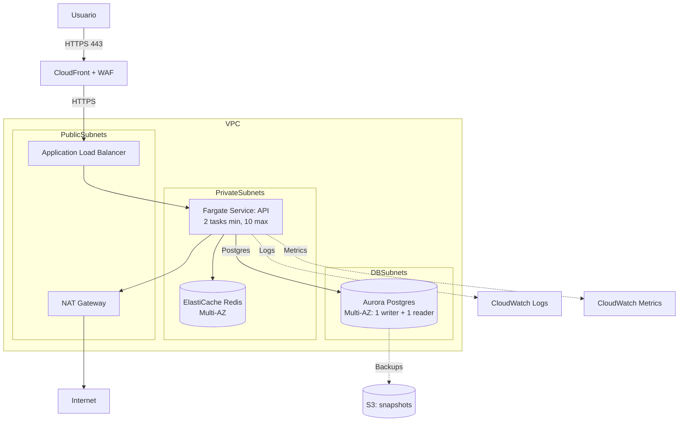
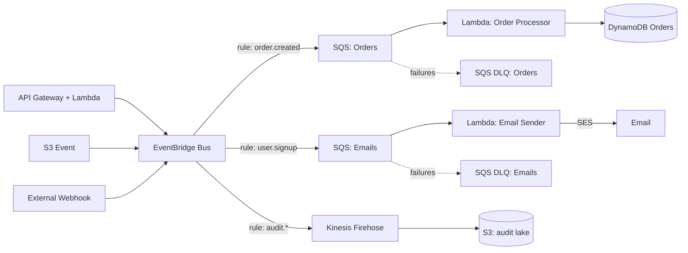
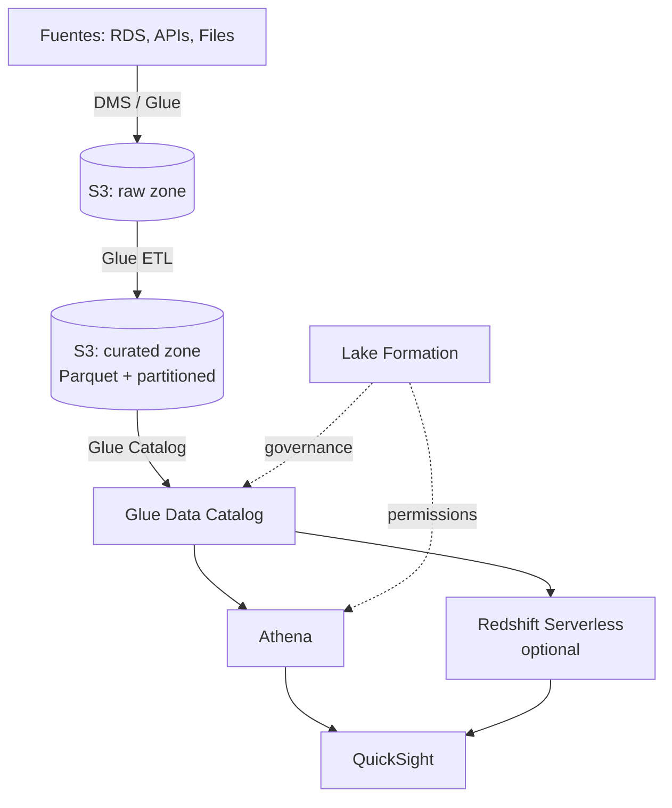
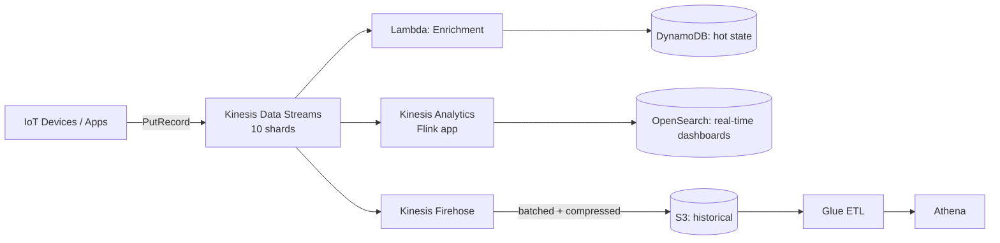
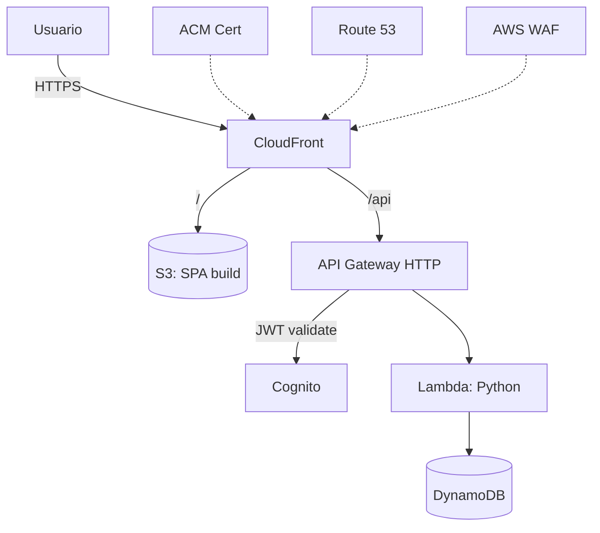
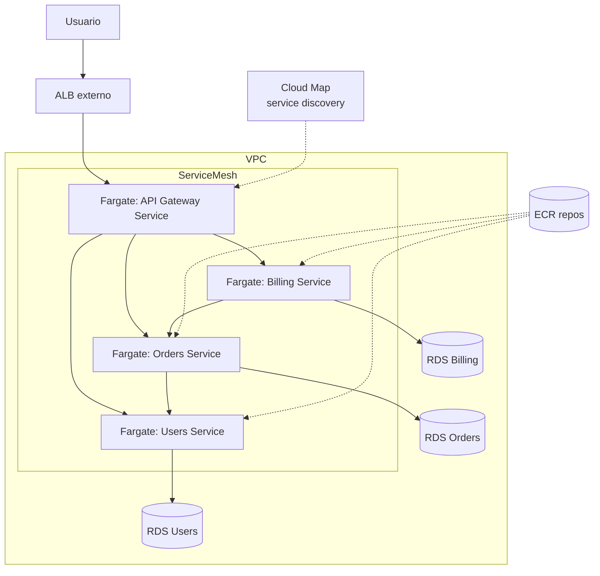
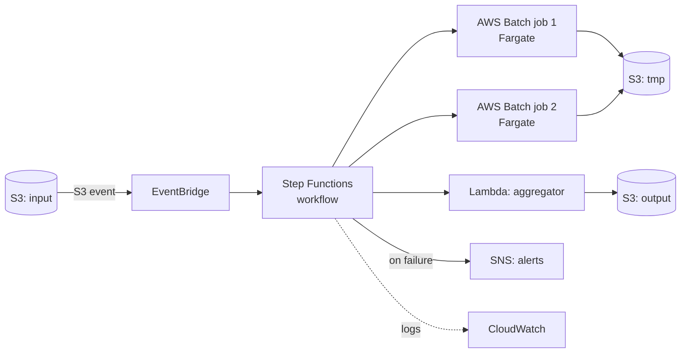

# Mermaid Templates

Diagramas base por patrón. Cópialos y ajústalos con los servicios reales del diseño. Convenciones:

- Subgraph por zona lógica (Internet, Edge, VPC, AZs, subnets).
- Servicios con prefijo de ícono textual (AWS no tiene íconos nativos en Mermaid — usamos labels claros).
- Flechas con protocolo cuando aplique: `-->|HTTPS|`, `-->|SQL|`, `-->|TLS|`.

**Validar siempre:** Mermaid v10+ es estricto con syntax. Probar con ```mermaid block en VSCode o mermaid.live.

---

## Template 1 — Serverless API



---

## Template 2 — 3-Tier Containers



---

## Template 3 — Event-Driven



---

## Template 4 — Data Lake



---

## Template 5 — Real-Time Streaming



---

## Template 6 — Static Site + API



---

## Template 7 — Microservicios Fargate



---

## Template 8 — Batch Processing



---

## Convenciones comunes

- **Cajas con `[ ]`:** servicios de compute o gateway.
- **Cajas con `[( )]`:** stores (DB, S3, cache).
- **Flechas sólidas `-->`:** flujo de datos primario.
- **Flechas punteadas `-.->`:** observabilidad, logs, metadata.
- **Subgraphs:** agrupar por VPC, AZ, zona lógica.
- **Labels en flechas `-->|texto|`:** protocolo o acción.

## Checklist antes de pegar en el doc

- [ ] `graph TD` o `graph LR` correcto según lectura.
- [ ] Sin caracteres especiales no escapados en labels (`<br/>` es válido; `()` en labels hay que escapar o usar comillas).
- [ ] Cada nodo se define una sola vez (Mermaid falla si redefines con diferente label).
- [ ] Subgraphs cierran con `end`.
- [ ] Probar en mermaid.live si hay duda.
